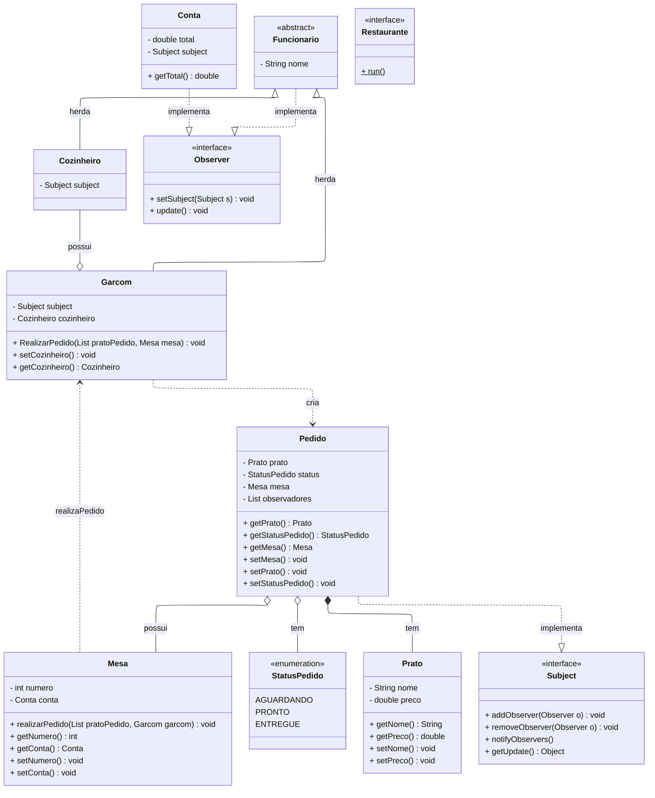

# Sistema de Gerenciamento de Pedidos - Restaurante

Este exercício implementa um **sistema de gerenciamento de pedidos** para um restaurante, simulando a comunicação entre **garçons**, **cozinheiros** e **mesas** de forma automatizada.  

O sistema foi desenvolvido em **Java**, seguindo os princípios da **Programação Orientada a Objetos** e aplicando o **Padrão de Projeto Observer (GoF)**.

---

## Objetivos
- Gerenciar pedidos realizados pelos clientes de um restaurante.  
- Acompanhar o **ciclo de vida de um pedido**, desde o momento em que é criado até a entrega.  
- Permitir que **diferentes entidades (Garçom, Cozinheiro e Conta)** sejam **notificadas automaticamente** quando o status de um pedido muda.

---

## Fluxo

1. O **Garçom** realiza um pedido para uma **Mesa**, com o status inicial **AGUARDANDO**.
2. O **Cozinheiro**, ao ser notificado, prepara o prato e altera o status para **PRONTO**.
3. O **Garçom** é notificado novamente, entrega o pedido ao cliente e altera o status para **ENTREGUE**.
4. A **Conta** da mesa observa as alterações e atualiza automaticamente o **total a pagar**.

---

## Padrão de Projeto: Observer

### Estrutura
- **Subject (Sujeito observado):** `Pedido`  
- **Observers (Observadores):** `Garcom`, `Cozinheiro`, `Conta`  

---

