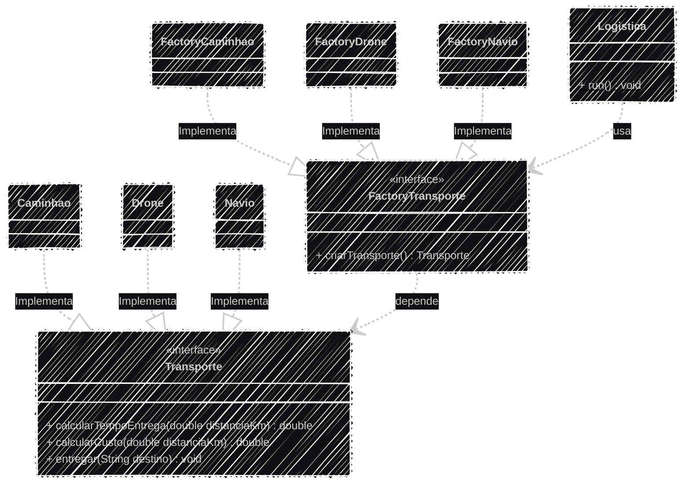

# Sistema de Logística (Entrega de Cargas)

Este projeto implementa um **sistema de logística** para uma empresa que busca ampliar suas modalidades de entrega para diferentes regiões e necessidades.  

O sistema foi desenvolvido em **Java**, seguindo os princípios da **Programação Orientada a Objetos (POO)** e aplicando o **Padrão de Projeto Factory Method (GoF)**.

---

## Objetivos

- Garantir **flexibilidade** na escolha e adição de novos tipos de entrega.  
- Manter o **código cliente desacoplado** das classes concretas que implementam o transporte.  
- Encapsular a **lógica específica de cálculo de custo, tempo e mensagem de entrega** em cada produto (`Transporte`).  

---

## Fluxo (Factory Method)

1. A classe cliente (`Logistica`) solicita a criação de um tipo de transporte através de uma **Fábrica Concreta** (ex: `FactoryCaminhao`).  
2. A fábrica invoca o **Método de Fábrica** (`criarTransporte()`) para instanciar a classe de produto correta (`Caminhao`).  
3. A fábrica retorna o objeto criado sob a interface comum (`Transporte`).  
4. O cliente utiliza o objeto `Transporte` para executar as operações de **cálculo e entrega**, sem depender de classes concretas específicas.

---

## Padrão de Projeto: Factory Method

O **Factory Method** define uma interface para criar um objeto, mas permite que **subclasses (as fábricas)** decidam qual classe concreta instanciar.

---

## Estrutura

| Função no Padrão | Classe/Interface | Descrição |
|------------------|------------------|------------|
| **Product (Produto)** | `Transporte` (Interface) | Define a interface comum para todos os meios de entrega. |
| **Concrete Products** | `Caminhao`, `Navio`, `Drone` | Implementam as regras de negócio de cada modalidade de entrega. |
| **Creator (Criador)** | `FactoryTransporte` (Interface) | Declara o método de fábrica, que retorna um objeto do tipo `Transporte`. |
| **Concrete Creators** | `FactoryCaminhao`, `FactoryNavio`, `FactoryDrone` | Implementam o método de fábrica, instanciando o produto concreto correspondente. |

---

## Regras de Negócio Implementadas

| Modalidade | Fórmula de Tempo (`calcularTempoEntrega`) | Fórmula de Custo (`calcularCusto`) |
|-------------|-------------------------------------------|------------------------------------|
| **Caminhão** | `distanciaKm / 60.0` | `1.8 * distanciaKm + 200` |
| **Navio** | `distanciaKm / 30.0 + 240` | `0.9 * distanciaKm + 800` |
| **Drone** | `distanciaKm / 100.0` | `5.0 * distanciaKm` |

---

